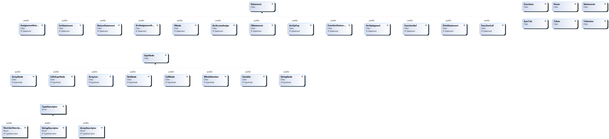

# Python Interpreter in C++

## Main Classes

| Class | Description|
| ------|---------|
|Symbol Table| This data structure is used to store the variables, data types and their values.
|Token|This data structure is used to store the token. The token can be a symbol (=,<,>,-,+ etc), token can be a variable name, token can be indent, etc.
|Tokenizer|This data structure makes tokens from the given input file
|Parser | This data structure will get tokens and decide and make statements. E.g if the token contains '=' sign then it means that it's assignmnet statement.
|Statements| This will store the statements made by Parser. It will later execute those statements.

## Flow of Program
1- Take a inStream of file as input. Store it in the tokenizer datastructure and program will use the file as needed.

2- Parser will use this tokenizer to get tokens. Parser will decide about the if/else/function/lambda and other statments. After decision about the line, parser makes a statement about that line and store it in Statements.

3- After tokenizing and parsing whole file the statements made are retured by the parser class. These statements are later executed according to there need with the help of symbol table

## Features

- Variable handling (integer or string)
- List (Strong list, integer or string)
- Addition, subtraction
- List addition (concatenation)
- List slicing
- Function handling
- Lambda handling
- Ternary operator
- Nested if else
- Printing

## Coding
Programing using the concepts of classes, oop, inheritance in classes. The basic class diagram is as following

